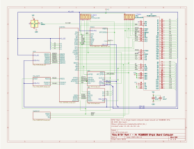

## Table of Contents
* [Hardware Documentation](#hardware-documentation)
  * [Schematic](#schematic)
  * [Connectors](#connectors)
  * [Jumpers](#jumpers)
  * [Bill of Materials](#bill-of-materials)
* [Firmware Documentation](#firmware-documentation)
   * [ROM: EmuTOS](#rom-emutos)
   * [SPLD Fuse Maps](#spld-fuse-maps)

## Hardware Documentation

### Schematics

This four layer, 102mm x 102mm board was created using [Kicad](https://www.kicad.org) version 8.0. The KiCad files
are available in this repository.

The image below shows the top level schematic page. Click on it to download the full eight page schematic in PDF format.

### Connectors

| Reference | Description                                                  |
| --------- | ------------------------------------------------------------ |
| J1        | Barrel jack connection for a 2A, 5V, 2mm power supply.       |
| J2        | Six pin male header for connection to a USB-to-serial adapters. Uses the [FTDI Friend](https://www.adafruit.com/product/284) pinout. |
| J3        | Five min male header for connection to a DS3231 Real Time Clock module. |
| J5        | 40-pin connection to an RCBus 40-pin or 80-pin backplane.    |

### Jumpers

| Refence | Picture | Description                                                  | Comment                                                      |
| ------- | ------- | ------------------------------------------------------------ | ------------------------------------------------------------ |
| JP1     |         | Connects RCBus /INT (pin 22) to 68K interrupt level 4 (1-2) or level 2 (2-3) | When using BITSY Mark I with the [XOSERA_RCBUS](https://github.com/codesmythe/XOSERA_RCBUS) board, jumper pins 1-2 to use 68K /INT4. |
| JP2     |         | When closed, connects RCBus USER1/INT1 (pin 37) to MFP GPIO4. When open, RCBus pin 37 is unconnected. | Close this jumper when using the [KEMOJO](https://github.com/codesmythe/KEMOJO) board for PS/2 keyboard, PS/2 mouse and joystick support. |

### Bill of Materials

[Text file parts list](BITSY_V1B_mouser.txt) for pasting into the [Mouser BOM tool](https://www.mouser.com/Bom/CopyPaste) (login required).

To obtain a BITSY Mark I PCB, download these [Gerbers](https://github.com/codesmythe/BITSY_MK_I/raw/refs/heads/main/BITSY_V1B.zip) for use at your preferred PCB manufacturer. I use JLCPCB.

#### SRAM choice

The board can use two standard 32-pin DIP 512KBx8 SRAM chips, such as the AS6C4008-55PCN SRAM for a total of 1MB of RAM.
The board has also been designed to accomodate special boards which adapt an SMT 2MBx8 SRAM to a 34-pin DIP footprint for a 
total of 4MB of RAM. So one build option to use standard 32-pin DIP sockets and add two single-pin female pin sockets
to accomodate the two extra pins required by the 34-pin DIP board. Another option is to use two 17-pin SIP sockets for the 
SRAM which will also work for either configuration.

| Component Type     | Reference          | Qty | Description                                                     | Part                                                                                     |
| ------------------ | ------------------ | --- | --------------------------------------------------------------- | ---------------------------------------------------------------------------------------- |
| CF Adapter         | none               |   1 | Compact Flash Male IDE 44pin adapter                            | eBay or Amazon: search for "Compact Flash Male IDE 44pin adapter"                        |
| Module             | none               |   1 | (optional) DS3231 I2C Real Time Clock module                    | Amazon: search for "DS3231 rtc module". Get a black one with 5-pin female connector and yellow battery.|
| Capacitor          | C1-C12,C14,C15     |  14 | 0.1 uF, MLCC, 5 mm Pitch                                        | Mouser [594-K104K15X7RF5TH5](https://www.mouser.com/ProductDetail/594-K104K15X7RF5TH5)   |
| Capacitor          | C92,C93            |   2 | Electrolytic Capacitor, Radial, 6.3V 470uF, 6.3D, 2.5P          | Mouser [80-ESK477M6R3AE3AA](https://www.mouser.com/ProductDetail/80-ESK477M6R3AE3AA)     |
| Capacitor          | C94                |   1 | MLCC, Leaded 100pF 50V 5% C0G 5mm                               | Mouser [594-K101J15C0GF5TH5](https://www.mouser.com/ProductDetail/594-K101J15C0GF5TH5)   |
| Capacitor          | C97,C98            |   2 | Electrolytic Capacitor, Radial, 16V, 100uF, 5D, 2.5P            | Mouser [667-ECA-1CM101I](https://www.mouser.com/ProductDetail/667-ECA-1CM101I)           |
| Capacitor          | CON1               |   1 | Audio Jack, 3 Poles, Switched TR Poles                          | Mouser [490-SJ1-3533NG](https://www.mouser.com/ProductDetail/490-SJ1-3533NG)             |
| Diode              | D1                 |   1 | Green LED, through hole, 5 mm pitch                             | Mouser [696-SSL-LX5093GT](https://www.mouser.com/ProductDetail/696-SSL-LX5093GT)         |
| Connector          | J1                 |   1 | DC Barrel Jack                                                  | Mouser [490-PJ-002A](https://www.mouser.com/ProductDetail/490-PJ-002A)                   |
| Connector          | J2                 |   1 | 1x6 right angle pin header                                      | Mouser [737-PH1RB-06-UA](https://www.mouser.com/ProductDetail/737-PH1RB-06-UA)           |
| Connector          | J3                 |   1 | 1x5 right angle pin header                                      | Mouser [737-PH1RB-05-UA](https://www.mouser.com/ProductDetail/737-PH1RB-05-UA)           |
| Connector          | J5                 |   1 | 1x40 right angle pin header                                     | Mouser [710-61304011021](https://www.mouser.com/ProductDetail/710-61304011021)           |
| Pin Header         | J6-J9              |   4 | 1x1 straight pin header                                         | Mouser [200-TSW10107TS](https://www.mouser.com/ProductDetail/200-TSW10107TS)             |
| Jumper             | JP1                |   1 | 1x3 straight pin header                                         | Mouser [200-TSW10307TS](https://www.mouser.com/ProductDetail/200-TSW10307TS)             |
| Jumper             | JP2                |   1 | 1x2 straight pin header                                         | Mouser [200-TSW10207TS](https://www.mouser.com/ProductDetail/200-TSW10207TS)             |
| Transistor         | Q1                 |   1 | 2N7000  MOSFET in TO92                                          | Mouser [512-2N7000](https://www.mouser.com/ProductDetail/512-2N7000)                     |
| Resistor           | R2                 |   1 | 470 ohm, axial, 1% tolerance, 1/4 W                             | Mouser [603-MFR-25FTE52-470R](https://www.mouser.com/ProductDetail/603-MFR-25FTE52-470R) |
| Resistor           | R3                 |   1 | 10K ohm, axial, 1% tolerance, 1/4 W                             | Mouser [603-MFR-25FTE52-10K](https://www.mouser.com/ProductDetail/603-MFR-25FTE52-10K)   |
| Resistor           | R84,R85            |   2 | 1K ohm, axial, 1% tolerance, 1/4 W                              | Mouser [603-MFR-25FTE52-1K](https://www.mouser.com/ProductDetail/603-MFR-25FTE52-1K)     |
| Resistor           | R86,R87            |   2 | 1600 ohm, axial, 1% tolerance, 1/4 W                            | Mouser [603-MFR-25FTE52-1K6](https://www.mouser.com/ProductDetail/603-MFR-25FTE52-1K6)   |
| Resistor           | R88-R90            |   3 | 3K ohm, axial, 1% tolerance, 1/4 W                              | Mouser [603-MFR-25FTE52-3K](https://www.mouser.com/ProductDetail/603-MFR-25FTE52-3K)     |
| Resistor           | R97                |   1 | 100 ohm, axial, 1% tolerance, 1/4 W                             | Mouser [603-MFR-25FBF52-100R](https://www.mouser.com/ProductDetail/603-MFR-25FBF52-100R) |
| Resistor           | RN1,RN2            |   2 | 4.7K ohm bussed network, 6 resistors, 7 pins, SIP               | Mouser [652-4607X-1LF-4.7K](https://www.mouser.com/ProductDetail/652-4607X-1LF-4.7K)     |
| Switch             | SW1                |   1 | Push button switch                                              | Mouser [179-TS026655BK160LCR](https://www.mouser.com/ProductDetail/179-TS026655BK160LCR) |
| Integrated Circuit | U1                 |   1 | MC68HC000 CPU in PLCC-68, 20 MHz                                | Ebay: search for "MC68HC000FN20"                                                         |
| Integrated Circuit | U2                 |   1 | TS68HC901 Multi Function Peripheral (MFP) chip in PLCC-52       | Ebay: search for "TS68HC901CFN8B"                                                        |
| Integrated Circuit | U3,U4              |   2 | SST39SF040 512k x 8 Flash ROM in PLCC-32                        | Mouser [579-39SF040554CNHET](https://www.mouser.com/ProductDetail/579-39SF040554CNHET)   |
| Integrated Circuit | U5,U6              |   2 | AS6C4008-55 512K x 8 Low Power CMOS RAM in DIP-32               | Mouser [913-AS6C4008-55PCN](https://www.mouser.com/ProductDetail/913-AS6C4008-55PCN)     |
| Integrated Circuit | U7                 |   1 | MIC1232 CPU Supervisor in 8-pin DIP                             | Mouser [998-MIC1232NY](https://www.mouser.com/ProductDetail/998-MIC1232NY)               |
| Integrated Circuit | U8-U11             |   4 | ATF22V10C-15PU, Simple PLD, 24 I/O in 24-pin DIP                | Mouser [556-AF22V10C15PU](https://www.mouser.com/ProductDetail/556-AF22V10C15PU)         |
| Integrated Circuit | U12                |   1 | AY-3-8913 Programmable Sound Generator (PSG) in 24-pin wide DIP | Ebay: search for "AY-3-8913"                                                             |
| Integrated Circuit | U14,U15            |   2 | 74HCT245 Octal Bus Transceivers in 20-pin DIP                   | Mouser [595-SN74HCT245N](https://www.mouser.com/ProductDetail/595-SN74HCT245N)           |
| Oscillator         | X1                 |   1 | 16 MHz can oscillator in 8-pin DIP                              | Mouser [815-ACH-16-EK](https://www.mouser.com/ProductDetail/815-ACH-16-EK)               |
| Oscillator         | X2                 |   1 | 7.3278 MHz can oscillator in 8-pin DIP                          | Mouser [774-MXO45HS-3C-7.3](https://www.mouser.com/ProductDetail/774-MXO45HS-3C-7.3)     |
| Oscillator         | X3                 |   1 | 2 MHz can oscillator in 8-pin DIP                               | Mouser [520-TCH200-X](https://www.mouser.com/ProductDetail/520-TCH200-X)                 |
| Socket             | Socket for U1      |   1 | 68-pin PLCC socket                                              | Mouser [575-682444](https://www.mouser.com/ProductDetail/575-682444)                     |
| Socket             | Socket for U2      |   1 | 52-pin PLCC socket                                              | Mouser [575-945224](https://www.mouser.com/ProductDetail/575-945224)                     |
| Socket             | Socket for U3,U4   |   2 | 32-pin PLCC socket                                              | Mouser [575-943224](https://www.mouser.com/ProductDetail/575-943224)                     |
| Socket             | Socket for U5,U6   |   2 | 32-pin wide DIP socket                                          | Mouser [737-ICS-632-T](https://www.mouser.com/ProductDetail/737-ICS-632-T)               |
| Socket             | Socket for U7      |   1 | 8-pin DIP socket                                                | Mouser [571-1-2199298-2](https://www.mouser.com/ProductDetail/571-1-2199298-2)           |
| Socket             | Socket for U8-U11  |   4 | 24-pin DIP socket                                               | Mouser [737-ICS-324-T](https://www.mouser.com/ProductDetail/737-ICS-324-T)               |
| Socket             | Socket for U12     |   1 | 24-pin wide DIP socket                                          | Mouser [737-ICS-624-T](https://www.mouser.com/ProductDetail/737-ICS-624-T)               |
| Socket             | Socket for U14,U15 |   2 | 20-pin DIP socket                                               | Mouser [737-ICS-320-T](https://www.mouser.com/ProductDetail/737-ICS-320-T)               |
| Socket             | Socket for X1-X3   |   3 | 8-pin oscillator socket                                         | Mouser [535-1108800](https://www.mouser.com/ProductDetail/535-1108800)                   |

## Firmware Documentation

### ROM: EmuTOS

This board is designed to run the [EmuTOS](https://emutos.sourceforge.io) operating system. EmuTOS is an open-source
variant of the Atari ST TOS operating system. The source code for my fork of EmuTOS to support various 68K single
board computers can be found [here](https://github.com/codesmythe/emutos). The version of EmuTOS in the fork is
based on EmuTOS version 1.4.

Two default configurations are provided by the ROM binaries in this repository. Other configurations are
available to compiling EmuTOS from the source code linked above.

#### Configuration: Using serial port command line I/O interface

The first configuraiton uses the UART provided by the MC68901 and runs EmuTOS in "serial console" mode. 
In this configuration, 1 MB of SRAM is supported, which can be provided using standard 512K 32-pin DIP SRAMs 
like the AS6C4008. The "EmuCON" part of EmuTOS provides a command line interface. Here are the even and odd
ROM binaries for this configuration:

| ROM  | Size   | File | 
| ---- | ------ | ---- |
| Even | 512KB  | [bitsy_v1_sercon_1mb_20250616.even.bin](https://github.com/codesmythe/BITSY_MK_I/raw/refs/heads/main/ROMS/bitsy_v1_sercon_1mb_20250616.even.bin) | 
| Odd  | 512KB  | [bitsy_v1_sercon_1mb_20250616.odd.bin](https://github.com/codesmythe/BITSY_MK_I/raw/refs/heads/main/ROMS/bitsy_v1_sercon_1mb_20250616.odd.bin) | 

#### Configuration: Using VGA and PS/2 support to run EmuTOS GUI (GEM)

The second configuration runs EmuTOS in full GUI (GEM) mode and requires the use of the 
[XOSERA_RCBUS](https://github.com/codesmythe/XOSERA_RCBUS) and [KEMOJO](https://github.com/codesmythe/KEMOJO) boards
to provide VGA output and PS/2 keyboard and mouse input. In this configuration, 4MB is required and so SMT SRAM 
adapter boards are required. It is possible to run GEM mode in 1 MB of RAM, but for you now you will have configure 
EmuTOS and compile it from source. Here are the even and odd ROM binaries for this configuration:

| ROM  | Size   | File | 
| ---- | ------ | ---- |
| Even | 512KB  | [bitsy_v1_gem_4mb_20250617.even.bin](https://github.com/codesmythe/BITSY_MK_I/raw/refs/heads/main/ROMS/bitsy_v1_gem_4mb_20250617.even.bin) |
| Odd  | 512KB  | [bitsy_v1_gem_4mb_20250617.odd.bin](https://github.com/codesmythe/BITSY_MK_I/raw/refs/heads/main/ROMS/bitsy_v1_gem_4mb_20250617.odd.bin)   |

#### Memory Map

| Address Range | Use  |
| --------------------------------|-----------------------------------------------------------------------------|
| 00_0000 to (0F_FFFF or 3F_FFFF) | 1 MB or 4 MB RAM                                                            |
| E0_0000 to EF_FFFF              | 1 MB ROM                                                                    |
| F0_0000 to F0_003F              | IDE (mirrored every 64 bytes in the 4K byte range from F0_0000 to F0_0FFF.) |
| FF_0000 to FF_FFFF              | 64K RC2014 IO (IOREQ). Includes on-board PSG and MFP.                       |

#### I/O Map

These addresses (and the IDE addresses above) are the same as the Atari ST for software compatibility.

| Address Range      | Use                                                                          | 
|--------------------|------------------------------------------------------------------------------|
| FF_FA00 to FF_FA2F | MFP (mirrored every 48 bytes in the 256 byte range from FF_FA00 to FA_FAFF.) |
| FF_8800 to FF_8803 | PSG (mirrored every  4 bytes in the 256 byte range from FF_8800 to FF_88FF.) | 

### SPLD Fuse Maps

BITSY Mark I uses four ATF22V10/GAL22V10 SPLDs (U8 - U11) for address decode and various other control logic. The SPLD fuse maps
(JED files) can be downloaded via the links in the table below. The SPLDs are implemented using Flash/EEPROM technology and can be
programmed by commonly available EPROM programmers, such as MiniPro TL866 II+ or newer. The source code (PLD) files 
are also provided in the repository. If needed, they can be modified. Use [GALasm](https://github.com/daveho/GALasm) 
to compile PLD files to JED fuse maps.

Note that there are separate fuse files for U9/HIDECODE depending on whether you are using 1 MB or 4 MB SRAM.

| Reference | Source File                      | JED File                                                                                      | Functions                                    |
| --------- | -------------------------------- | --------------------------------------------------------------------------------------------- | -------------------------------------------- |
| U8        | [MEMCTL.PLD](MEMCTL.PLD)         | [MEMCTL.jed](https://github.com/codesmythe/BITSY_MK_I/raw/refs/heads/main/MEMCTL.jed)         | Interrupt control, RCBus interface           |
| U9 (1 MB) | [HIDECODE.PLD](HIDECODE.PLD)     | [HIDECODE.jed](https://github.com/codesmythe/BITSY_MK_I/raw/refs/heads/main/HIDECODE.jed)     | Decode high part of address bus for 1 MB SRAM                |
| U9 (4 MB) | [HIDECODE_4MB.PLD](HIDECODE.PLD) | [HIDECODE_4MB.jed](https://github.com/codesmythe/BITSY_MK_I/raw/refs/heads/main/HIDECODE_4MB.jed) | Decode high part of address bus for 4 MB SRAM          |
| U10       | [CONTROL.PLD](CONTROL.PLD)       | [CONTROL.jed](https://github.com/codesmythe/BITSY_MK_I/raw/refs/heads/main/CONTROL.jed)   | Wait states, DTACK generation, IDE interface |
| U11       | [DECODE.PLD](DECODE.PLD)         | [DECODE.jed](https://github.com/codesmythe/BITSY_MK_I/raw/refs/heads/main/DECODE.jed)     | Decode low part of address bus               |

### Acknowledgements

When I designed this board, I took ideas and inspiration from these projects:

- Bill Shen's [Tiny68K](https://www.retrobrewcomputers.org/doku.php?id=boards:sbc:tiny68k) board.

- John Coffmans's [Mini-68K](https://www.retrobrewcomputers.org/doku.php?id=boards:ecb:mini-68k:start) ECB board.

- Clements, Alan. [*Microprocessor Systems Design: 68000 Hardware, Software and Interfacing, Third Edition*](https://archive.org/details/microprocessor-systems-design-alan-clements-9780534948221)
 PWS Publishing Company, 1997.

- [Atari ST schematics](https://archive.org/details/Atari_520ST_Schematic_1985/mode/1up)

- Various [Motorola Application Notes](http://www.bitsavers.org/components/motorola/_appNotes/) from back in the day.

The sound output circuit is borrowed from https://hw.speccy.cz/melodik2.html by way of https://github.com/electrified/rc2014-ym2149/blob/main/README.md